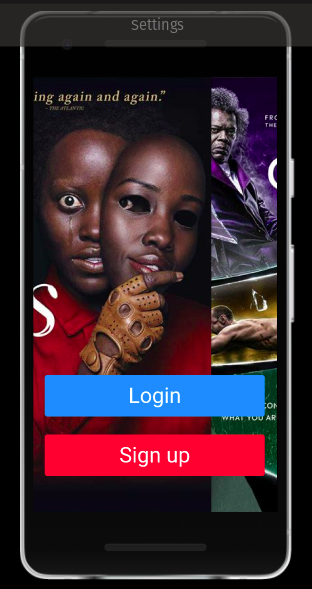
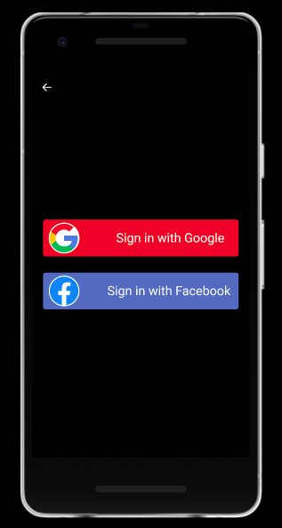
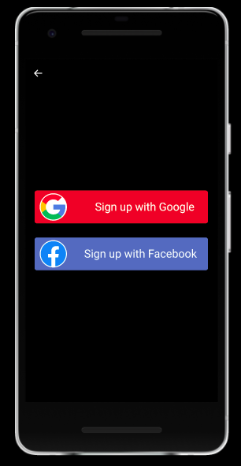

# movie_wallet

  Movie Wallet is an App to save your watched movies with your rating note about them.

<a href="https://www.figma.com/file/uUoBtzAi2qcNCg0LAzNzmA/Movie-Wallet?node-id=0%3A1" target="_blank">Check out the project on Figma</a>

<!--Prototype images here-->
## Authentication Prototype

